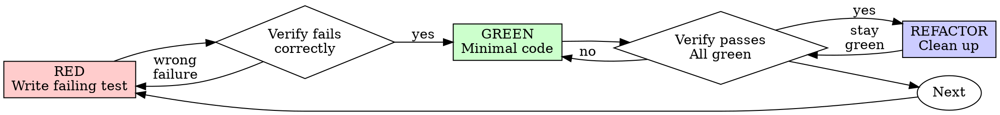

# Test-Driven Development (TDD)

## Overview

Write the test first. Watch it fail. Write minimal code to pass.

**Core principle:** If you didn't watch the test fail, you don't know if it tests the right thing.

**A strong default in service of shipping — not a law that outranks it.** TDD earns its keep where a failing test pins down behavior you'd otherwise get wrong: core logic, contracts, tricky edge cases. Match it to stakes — reach for it where test-first genuinely de-risks the change; throwaway prototypes, one-line copy tweaks, and obvious glue don't need the ceremony. Don't dodge it with synonyms; equally, don't let it block you from shipping the working thing.

## When to Use

**Use test-first for selected behavior where regression risk warrants it:**
- New features
- Bug fixes
- Refactoring
- Behavior changes

**Choose proportionate verification for work such as:**
- Throwaway prototypes
- Generated code
- Configuration files

Resolve the task's selected project/mission/slice procedure first. A required
TDD step remains required within that scope; changing it needs the authority
named by that selection. Outside it, choose verification that can detect the
failure without adding a human approval ritual. The procedure below describes
TDD when selected, not a completion gate for every kind of work.

**Chunk size follows the outcome.** Keep red → green → refactor for the behavior
being changed and build a coherent chunk. TDD does not require two people,
pre-edit permission or a guard: independence and review cadence come from the
project/mission/slice component or wave selection. An explicitly selected gate
still applies; an unselected role cannot add one.


## Test-First Contract for Selected Behavior

```
Selected TDD behavior: observe the expected failure before implementing the fix.
```

Already wrote the implementation? Preserve existing and others' bytes. Establish
the failing baseline in an isolated copy or by reversibly setting aside only
your owned change, then implement from the behavioral test. This skill grants
no authority to delete code. If a failing baseline cannot be demonstrated,
record that limit and follow the selected procedure; do not call tests-after TDD.

## Red-Green-Refactor



### RED - Write Failing Test

Write one minimal test showing what should happen.

<Good>
```typescript
test('retries failed operations 3 times', async () => {
  let attempts = 0;
  const operation = () => {
    attempts++;
    if (attempts < 3) throw new Error('fail');
    return 'success';
  };

  const result = await retryOperation(operation);

  expect(result).toBe('success');
  expect(attempts).toBe(3);
});
```
Clear name, tests real behavior, one thing
</Good>

<Bad>
```typescript
test('retry works', async () => {
  const mock = jest.fn()
    .mockRejectedValueOnce(new Error())
    .mockRejectedValueOnce(new Error())
    .mockResolvedValueOnce('success');
  await retryOperation(mock);
  expect(mock).toHaveBeenCalledTimes(3);
});
```
Vague name, tests mock not code
</Bad>

**Requirements:**
- One behavior
- Clear name
- Real code (no mocks unless unavoidable)

### Verify RED - Watch It Fail

**Required to establish RED in the selected TDD cycle.**

```bash
npm test path/to/test.test.ts
```

Confirm:
- Test fails (not errors)
- Failure message is expected
- Fails because feature missing (not typos)

**Test passes?** You're testing existing behavior. Fix test.

**Test errors?** Fix error, re-run until it fails correctly.

### GREEN - Minimal Code

Write simplest code to pass the test.

<Good>
```typescript
async function retryOperation<T>(fn: () => Promise<T>): Promise<T> {
  for (let i = 0; i < 3; i++) {
    try {
      return await fn();
    } catch (e) {
      if (i === 2) throw e;
    }
  }
  throw new Error('unreachable');
}
```
Just enough to pass
</Good>

<Bad>
```typescript
async function retryOperation<T>(
  fn: () => Promise<T>,
  options?: {
    maxRetries?: number;
    backoff?: 'linear' | 'exponential';
    onRetry?: (attempt: number) => void;
  }
): Promise<T> {
  // YAGNI
}
```
Over-engineered
</Bad>

Don't add features, refactor other code, or "improve" beyond the test.

### Verify GREEN - Watch It Pass

**Required to establish GREEN in the selected TDD cycle.**

```bash
npm test path/to/test.test.ts
```

Confirm:
- Test passes
- Other tests still pass
- Output pristine (no errors, warnings)

**Test fails?** Fix code, not test.

**Other tests fail?** Fix now.

### REFACTOR - Clean Up

After green only:
- Remove duplication
- Improve names
- Extract helpers

Keep tests green. Don't add behavior.

### Repeat

Next failing test for next feature.

## Good Tests

| Quality | Good | Bad |
|---------|------|-----|
| **Minimal** | One thing. "and" in name? Split it. | `test('validates email and domain and whitespace')` |
| **Clear** | Name describes behavior | `test('test1')` |
| **Shows intent** | Demonstrates desired API | Obscures what code should do |

## Why Order Matters

**"I'll write tests after to verify it works"**

Tests written after code pass immediately. Passing immediately proves nothing:
- Might test wrong thing
- Might test implementation, not behavior
- Might miss edge cases you forgot
- You never saw it catch the bug

Test-first forces you to see the test fail, proving it actually tests something.

**"I already manually tested all the edge cases"**

Manual testing is ad-hoc. You think you tested everything but:
- No record of what you tested
- Can't re-run when code changes
- Easy to forget cases under pressure
- "It worked when I tried it" ≠ comprehensive

Automated tests are systematic. They run the same way every time.

**"I already spent X hours on the implementation"**

Time spent does not prove behavior. Preserve the work and demonstrate that the
test detects the missing behavior on a baseline without the owned change.
Then verify the implementation against it. Report the actual sequence honestly.

**"TDD is dogmatic, being pragmatic means adapting"**

TDD IS pragmatic:
- Finds bugs before commit (faster than debugging after)
- Prevents regressions (tests catch breaks immediately)
- Documents behavior (tests show how to use code)
- Enables refactoring (change freely, tests catch breaks)

"Pragmatic" shortcuts = debugging in production = slower.

**"Tests after achieve the same goals - it's spirit not ritual"**

No. Tests-after answer "What does this do?" Tests-first answer "What should this do?"

Tests-after are biased by your implementation. You test what you built, not what's required. You verify remembered edge cases, not discovered ones.

Tests-first force edge case discovery before implementing. Tests-after verify you remembered everything (you didn't).

30 minutes of tests after ≠ TDD. You get coverage, lose proof tests work.

## Common Rationalizations

These challenges apply within selected TDD work, not to an authorized choice
of another verification method.

| Excuse | Reality |
|--------|---------|
| "Too simple to test" | Simplicity alone does not waive a selected behavioral check. |
| "I'll test after" | Tests passing immediately prove nothing. |
| "Tests after achieve same goals" | Tests-after = "what does this do?" Tests-first = "what should this do?" |
| "Already manually tested" | Ad-hoc ≠ systematic. No record, can't re-run. |
| "Already spent X hours" | Time spent is not evidence; preserve the work and prove the failing baseline. |
| "Keep as reference, write tests first" | Tests derived from the implementation risk repeating its assumptions; use the required behavior and a failing baseline. |
| "Need to explore first" | Keep exploration separate from the implementation and begin the selected TDD cycle when the behavior is understood. |
| "Test hard = design unclear" | Listen to test. Hard to test = hard to use. |
| "TDD will slow me down" | TDD faster than debugging. Pragmatic = test-first. |
| "Manual test faster" | Manual doesn't prove edge cases. You'll re-test every change. |
| "Existing code has no tests" | You're improving it. Add tests for existing code. |

## Red Flags in Selected TDD Work

- Code before test
- Test after implementation
- Test passes immediately
- Can't explain why test failed
- Tests added "later"
- Rationalizing "just this once"
- "I already manually tested it"
- "Tests after achieve the same purpose"
- "It's about spirit not ritual"
- "Keep as reference" or "adapt existing code"
- "Already spent X hours, so verification can wait"
- "TDD is dogmatic, I'm being pragmatic"
- "This is different because..."

Check whether the claimed RED → GREEN sequence actually happened. Repair the
missing evidence using the preservation rule above; these signals never
authorize deleting existing work.

## Example: Bug Fix

**Bug:** Empty email accepted

**RED**
```typescript
test('rejects empty email', async () => {
  const result = await submitForm({ email: '' });
  expect(result.error).toBe('Email required');
});
```

**Verify RED**
```bash
$ npm test
FAIL: expected 'Email required', got undefined
```

**GREEN**
```typescript
function submitForm(data: FormData) {
  if (!data.email?.trim()) {
    return { error: 'Email required' };
  }
  // ...
}
```

**Verify GREEN**
```bash
$ npm test
PASS
```

**REFACTOR**
Extract validation for multiple fields if needed.

## Verification Checklist

Before claiming the selected TDD work complete:

- [ ] Tests cover the selected behavioral outcomes
- [ ] Watched each test fail before implementing
- [ ] Each test failed for expected reason (feature missing, not typo)
- [ ] Wrote minimal code to pass each test
- [ ] All tests pass
- [ ] Output pristine (no errors, warnings)
- [ ] Tests use real code (mocks only if unavoidable)
- [ ] Edge cases and errors covered

An unmet selected check remains visible. Address it or obtain the disposition
required by the selected procedure; do not turn this checklist into a gate on
unselected work or erase code to make the history look test-first.

## When Stuck

| Problem | Solution |
|---------|----------|
| Don't know how to test | Write the desired API and assertion first. Consult the relevant peer or work owner if the behavior is unclear. |
| Test too complicated | Design too complicated. Simplify interface. |
| Must mock everything | Code too coupled. Use dependency injection. |
| Test setup huge | Extract helpers. Still complex? Simplify design. |

## Debugging Integration

For a bug in selected TDD scope, write a failing test reproducing it. Follow the
TDD cycle to demonstrate the fix and prevent regression.

Outside that scope, choose a proportionate regression check and retain its evidence.

## Testing Anti-Patterns

When adding mocks or test utilities, read @testing-anti-patterns.md to avoid common pitfalls:
- Testing mock behavior instead of real behavior
- Adding test-only methods to production classes
- Mocking without understanding dependencies

## Final Rule

```
Selected TDD behavior → test exists and failed first
Otherwise → do not claim a test-first sequence
```

Honor explicitly selected gates and their decision owner. This skill adds no
universal human permission step, deletion authority or gate on unselected work.
